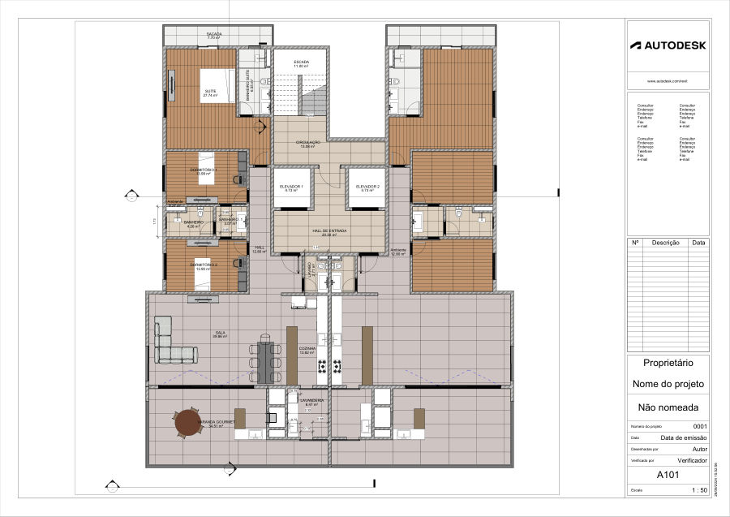

# Condomínio Residencial: Planta do Pavimento-Tipo

**Data da prancha:** setembro de 2024  
**Tipo:** <!-- PREENCHER: trabalho acadêmico (disciplina) ou estudo pessoal/profissional -->  
**Ferramenta:** Autodesk Revit

## Objetivo

<!-- PREENCHER: objetivo e contexto do projeto -->
Projeto arquitetônico de edifício residencial multifamiliar com duas unidades por pavimento, atendidas por circulação vertical central (escada e dois elevadores).

## Metodologia

Modelagem BIM em Revit, com planta humanizada (mobiliário e revestimentos) na escala 1:50 e identificação das áreas dos ambientes.

## Resultados

Unidade-tipo com:

| Ambiente | Área |
|---|---|
| Sala | 39,86 m² |
| Varanda gourmet | 34,51 m² |
| Suíte | 27,74 m² |
| Dormitórios 1 e 2 | 13,99 m² e 13,90 m² |
| Cozinha | 13,82 m² |
| Lavanderia | 6,47 m² |
| Banheiro da suíte / banheiros / lavabo | 6,55 / 4,26 e 3,07 / 2,71 m² |
| Sacada | 7,70 m² |

Áreas comuns: hall de entrada (20,30 m²), circulação (13,08 m²), escada (11,00 m²) e 2 elevadores.

<!-- PREENCHER: outras pranchas (cortes, fachadas) se existirem -->

## Arquivos

| Arquivo | Descrição |
|---|---|
| [docs/planta-nivel-1.pdf](docs/planta-nivel-1.pdf) | Planta do nível 1 (1:50) |
