# Reforma de Cozinha: Projeto Executivo de Interiores

**Tipo:** projeto profissional para cliente particular  
**Data:** novembro de 2024  
**Fase:** executivo (12 folhas)  
**Ferramenta:** SketchUp (modelo 3D e quantitativo)

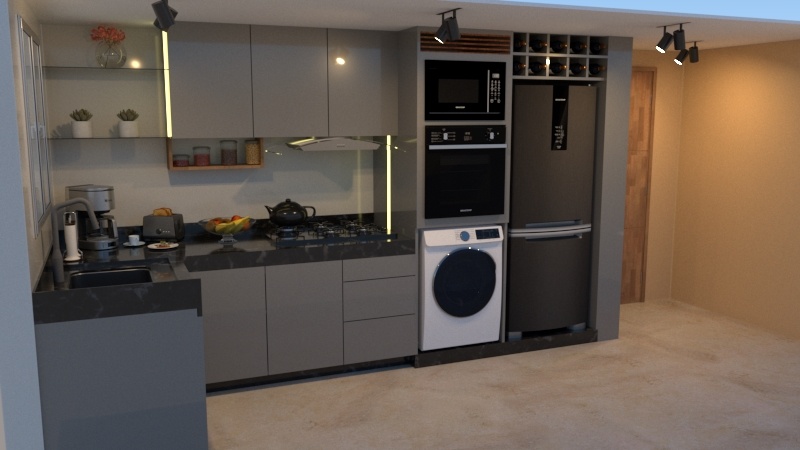

## Objetivo

Reformar a cozinha para criar um ambiente moderno, funcional e acolhedor, otimizando o espaço e a circulação. O projeto foi levado até o nível **executivo**, com todas as informações para a marcenaria e a marmoraria fabricarem e instalarem as peças.

<!-- PREENCHER: se a reforma foi executada -->

## Solução adotada

- Ambiente de cerca de **3,80 × 1,80 m**, organizado em **"L"**:
  - bancada com cuba e cooktop;
  - **torre quente** com forno e micro-ondas em altura ergonômica, ao lado da geladeira e da lavadora;
  - **nicho iluminado** junto à porta.
- **Materiais:**
  - bancadas em **mármore preto**;
  - armários em **MDF cinza-sagrado**, com detalhes em madeira;
  - fundos em **MDF branco**;
  - piso em **porcelanato de grande formato**.
- **Iluminação** com LED embutido na marcenaria e trilho de spots.
- **Coifa/depurador** integrada aos armários aéreos.

## Metodologia

1. **Modelagem 3D** do ambiente e do mobiliário, com renders do resultado final.
2. **Plantas e vistas cotadas** (1:20) do ambiente, incluindo a **planta de roda-base**, que define o rodapé recuado dos armários inferiores.
3. **Detalhamento da marcenaria** (1:10 e 1:20) módulo a módulo, com notas de execução para o marceneiro.
4. **Quantitativo** das peças de MDF extraído do modelo no SketchUp, por material e dimensão, com estimativa de chapas e de custo de material pesquisada em fornecedor.
5. **Detalhamento da marmoraria:** planta e vista da bancada em "L" com recortes para cuba e cooktop.

## Resultados

Projeto executivo completo em 12 folhas, com:
- 3D e renders;
- 3 desenhos de planta e vista do ambiente;
- 5 folhas de marcenaria;
- quantitativo e orçamento de material;
- marmoraria.

As notas de execução que constam nas pranchas incluem:
- **marcenaria:**
  - prever recuo da caixaria da gaveta e o sentido de abertura das portas;
  - prever furo para o gás do forno;
  - conferir as medidas do forno e do micro-ondas antes do corte;
- **elétrica:**
  - prever fonte de energia para todos os eletrodomésticos;
  - pontos e interruptor para o LED;
  - ponto de energia para o depurador;
- **marmoraria:**
  - conferir as medidas do cooktop e das cubas antes do corte;
  - garantir o alinhamento da pedra com a marcenaria.

| | |
|---|---|
|  |  |
| 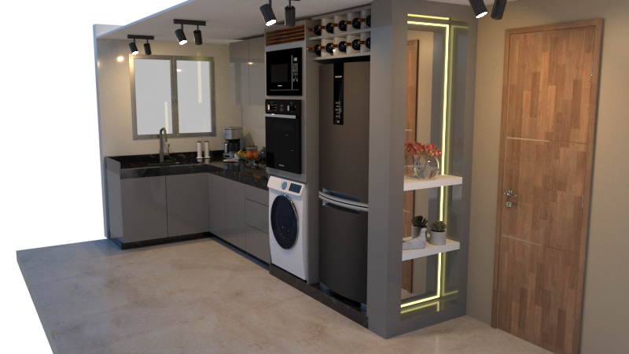 | |

## Pranchas

### Folha 01/12: projeto 3D

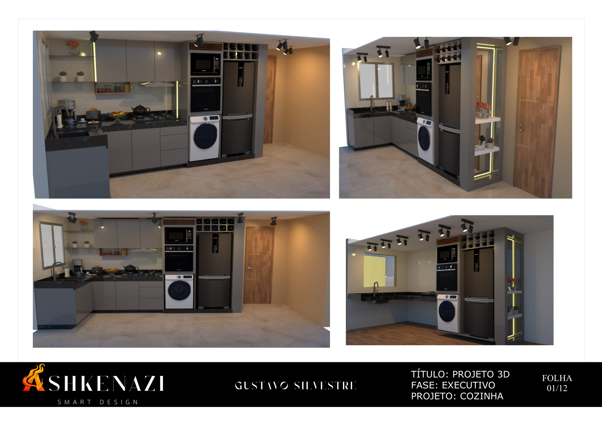

Renders do ambiente reformado, de quatro pontos de vista. [PDF da folha](docs/01-projeto-3d.pdf)

### Folha 02/12: planta (1:20)

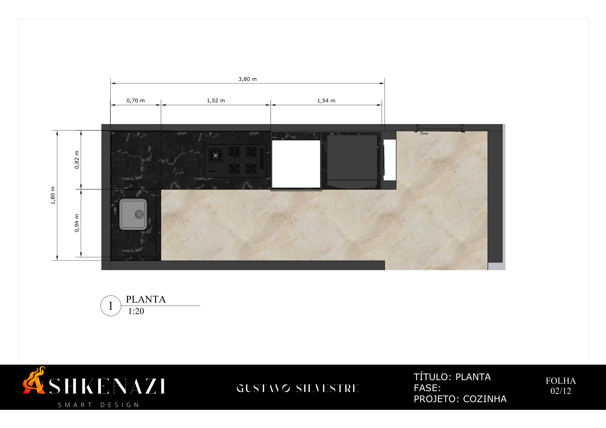

Planta do ambiente (3,80 × 1,80 m) com a bancada em "L", a torre quente e as cotas dos módulos. [PDF da folha](docs/02-planta.pdf)

### Folha 03/12: planta de roda-base (1:20)

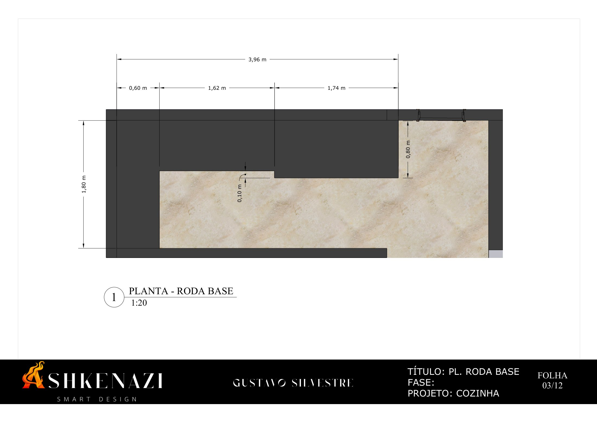

Contorno da base dos armários inferiores, com o recuo do rodapé em relação às portas. [PDF da folha](docs/03-planta-roda-base.pdf)

### Folha 04/12: vista (1:20)

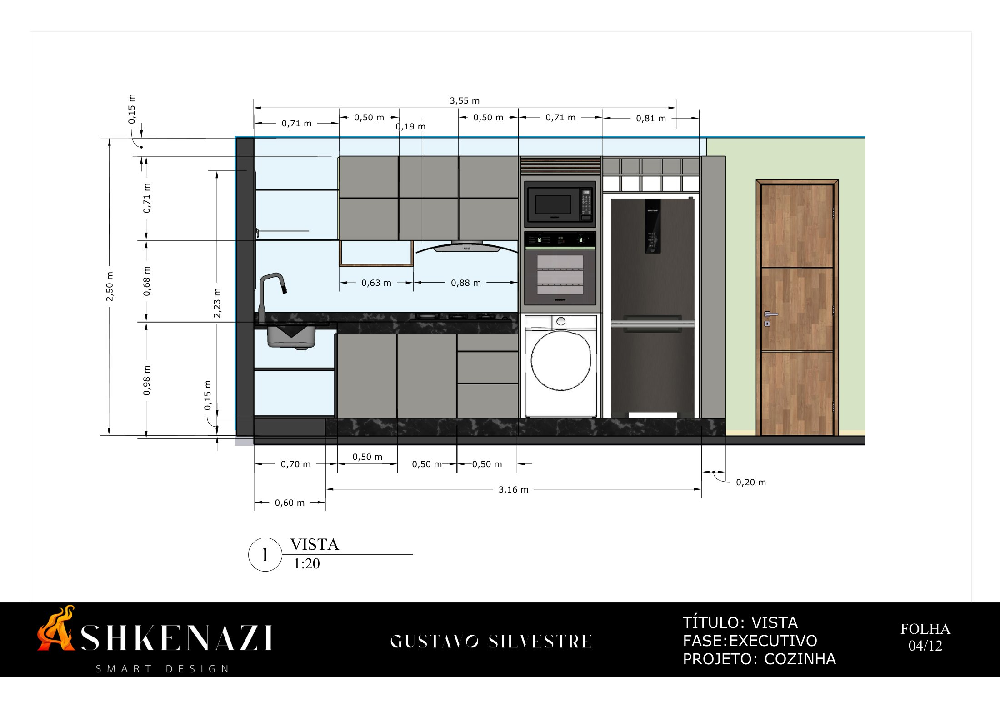

Elevação da parede principal: armários inferiores e aéreos, coifa, torre quente, geladeira e porta, com alturas e larguras de cada módulo. [PDF da folha](docs/04-vista.pdf)

### Folha 05/12: vistas e 3D

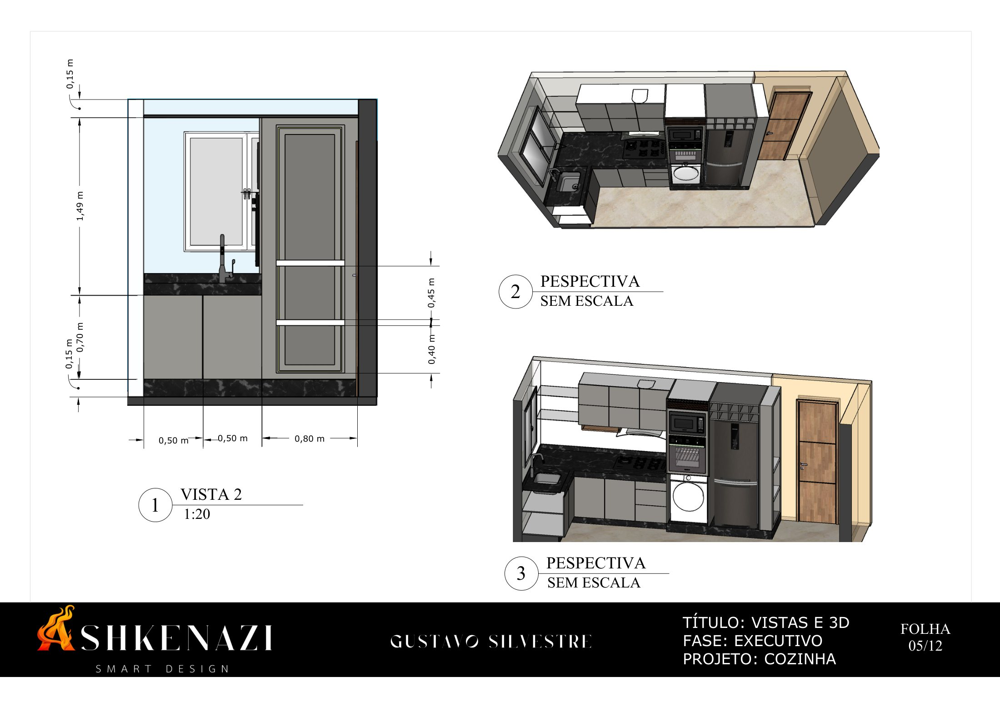

Vista lateral com a bancada da pia e a geladeira (1:20), mais duas perspectivas do conjunto. [PDF da folha](docs/05-vistas-e-3d.pdf)

### Folha 06/12: marcenaria, perspectiva geral

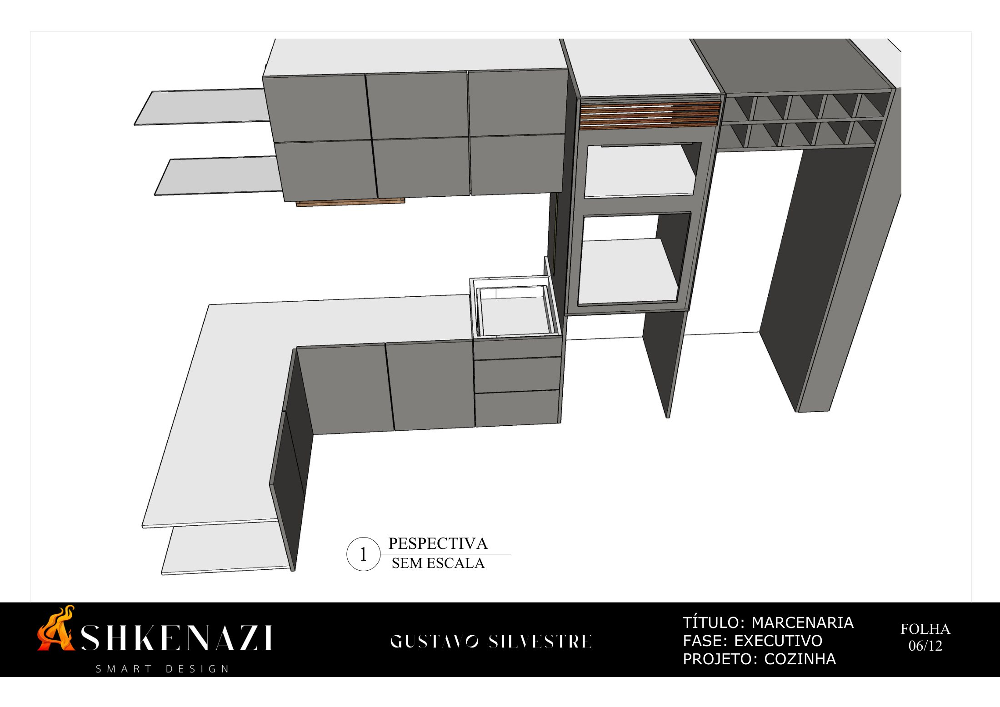

Perspectiva de todo o mobiliário sem acabamentos, mostrando a estrutura dos módulos. [PDF da folha](docs/06-marcenaria-perspectiva.pdf)

### Folha 07/12: marcenaria, bancada em "L"

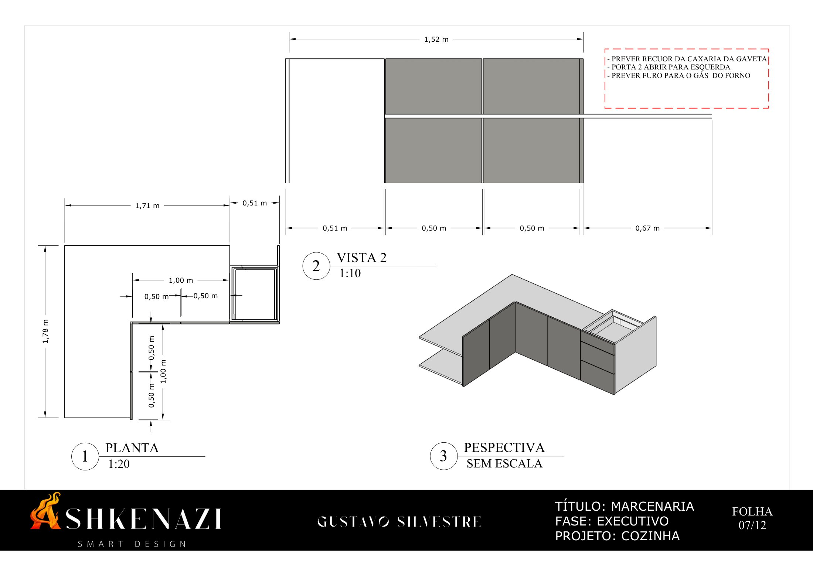

Planta (1:20), vista (1:10) e perspectiva dos armários inferiores, com notas sobre gavetas, portas e furo para o gás. [PDF da folha](docs/07-marcenaria-bancada.pdf)

### Folha 08/12: marcenaria, torre quente

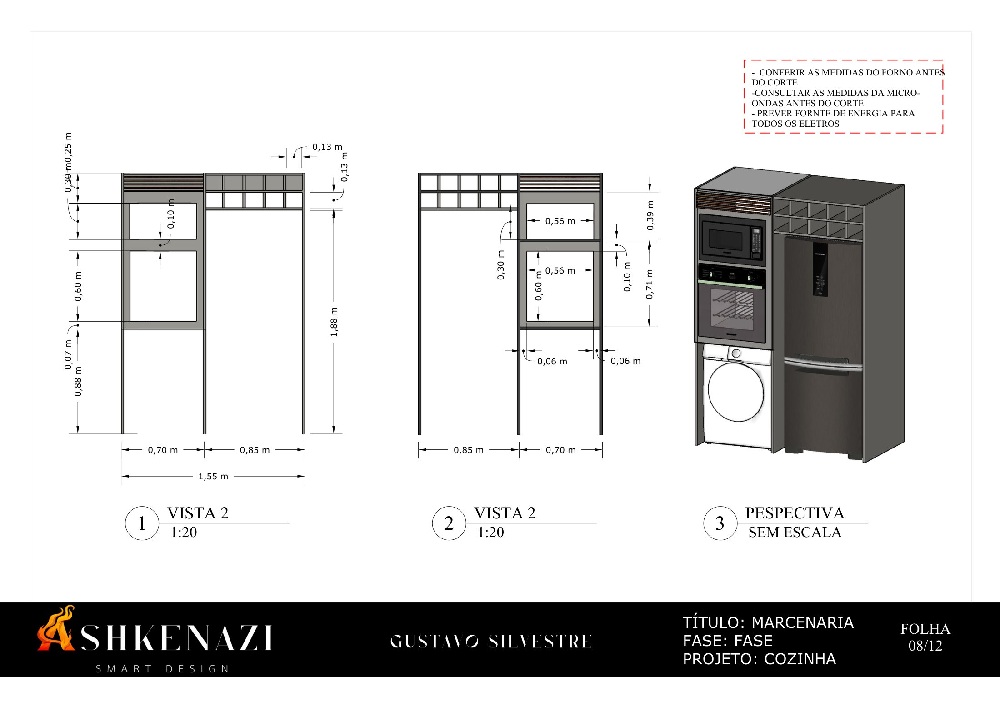

Vistas (1:20) e perspectiva da torre para forno e micro-ondas, com adega e espaço para lavadora e geladeira. [PDF da folha](docs/08-marcenaria-torre-quente.pdf)

### Folha 09/12: marcenaria, nicho com LED

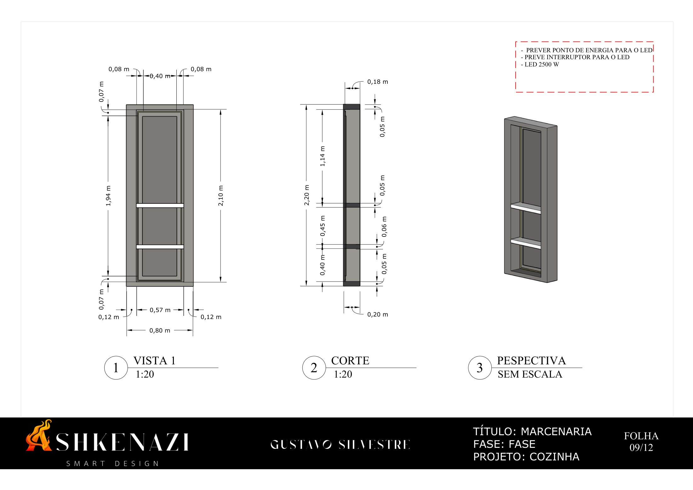

Vista, corte (1:20) e perspectiva do nicho de 0,80 × 2,20 m com prateleiras e iluminação em LED. [PDF da folha](docs/09-marcenaria-nicho-led.pdf)

### Folha 10/12: marcenaria, armários aéreos e depurador

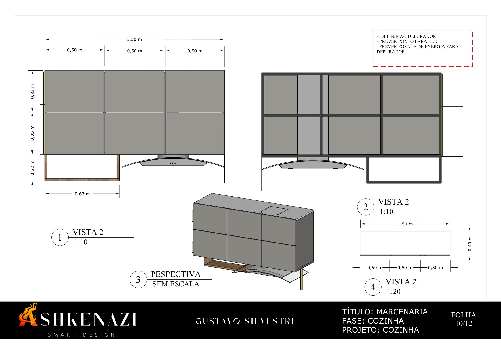

Armários aéreos de 1,50 m em três módulos de 0,50 m, prateleira em madeira e integração do depurador (vistas 1:10 e 1:20). [PDF da folha](docs/10-marcenaria-aereos-e-depurador.pdf)

### Folha 11/12: quantitativo e preço

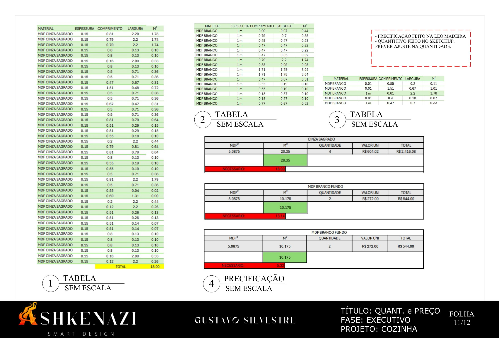

Tabelas com as peças de MDF por material e dimensão e a estimativa de chapas e de custo de material. [PDF da folha](docs/11-quantitativo-e-orcamento.pdf)

### Folha 12/12: marmoraria

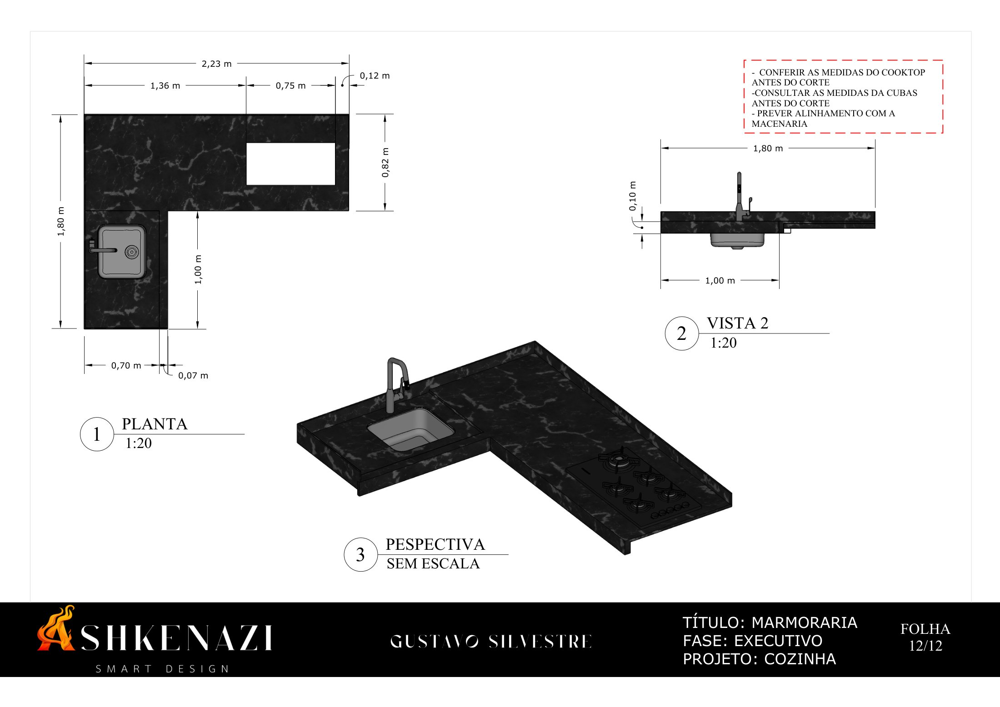

Planta (1:20), vista e perspectiva da bancada em "L" em mármore preto, com recortes para cuba e cooktop. [PDF da folha](docs/12-marmoraria.pdf)

## Arquivos

| Arquivo | Descrição |
|---|---|
| [docs/projeto-executivo-cozinha.pdf](docs/projeto-executivo-cozinha.pdf) | Projeto executivo completo (descrição e 12 folhas) |

> A capa do documento original foi omitida porque continha dados da cliente.
