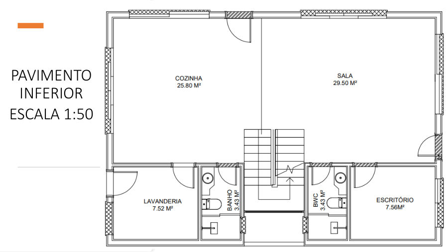

# Residência Unifamiliar: Projeto Arquitetônico Completo

**Disciplina:** PJIU4 · Técnico em Edificações, IFSP – Campus São Paulo  
**Período:** <!-- PREENCHER: ano/semestre -->  
**Tipo:** trabalho acadêmico individual

## Objetivo

Desenvolver o projeto de uma residência unifamiliar de dois pavimentos para uma família de 5 pessoas, a partir de uma entrevista com os clientes.

## Metodologia

1. **Programa de necessidades:**
   - 3 dormitórios, sendo uma suíte com closet;
   - cozinha americana e claraboia;
   - janela na escada com a largura da escada e cerca de dois pés-direitos de altura;
   - lote de 10 × 29 m.
2. **Fundamentos:** legislação municipal (código de obras), pedidos dos clientes, programa de necessidades e orientação solar.
3. **Estudo volumétrico** e setorização: social, íntimo, serviços e circulação.
4. **Desenvolvimento do projeto** até o nível de detalhamento.

## Resultados

Conjunto de pranchas com:
- **Plantas** 1:50 dos pavimentos, incluindo teto verde e laje acessível.
- **Fachadas** leste, norte e oeste, mais vista isométrica.
- **Cortes** longitudinal e transversal 1:50.
- **Detalhes** 1:20 da escada, do guarda-corpo e da cobertura.
- **Elevações de áreas molhadas**, com tabelas de metais e louças.
- **Implantação** na quadra (1:100).
- **Estrutura:** pilares 20×40, vigas 20×40, lajes h = 14 cm e detalhamento de armaduras.
- **Detalhes construtivos e especificações:**
  - esquadrias: 14 janelas e 16 portas;
  - revestimentos, soleiras e peitoris;
  - impermeabilização;
  - caixa d'água de 1.500 L.

## Arquivos

| Arquivo | Descrição |
|---|---|
| [docs/residencia-unifamiliar-pranchas.pdf](docs/residencia-unifamiliar-pranchas.pdf) | Pranchas do projeto (15 p.) |

> A capa e a página de entrevista do documento original foram omitidas porque continham nomes e dados pessoais.
