# Residência Unifamiliar: Projeto Arquitetônico Completo

**Disciplina:** PJIU4 · Técnico em Edificações, IFSP – Campus São Paulo  
**Período:** <!-- PREENCHER: ano/semestre -->  
**Tipo:** trabalho acadêmico individual

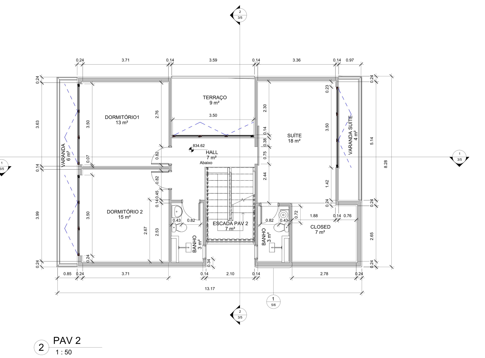

## Objetivo

Desenvolver o projeto de uma residência unifamiliar de dois pavimentos para uma família de 5 pessoas, a partir de uma entrevista com os clientes.

## Metodologia

1. **Programa de necessidades:**
   - 3 dormitórios, sendo uma suíte com closet;
   - cozinha americana e claraboia;
   - janela na escada com a largura da escada e cerca de dois pés-direitos de altura;
   - lote de 10 × 29 m.
2. **Fundamentos:** legislação municipal (código de obras), pedidos dos clientes, programa de necessidades e orientação solar.
3. **Estudo volumétrico** e setorização: social, íntimo, serviços e circulação.
4. **Desenvolvimento do projeto** até o nível de detalhamento.

## Resultados

Conjunto de 11 pranchas, apresentadas uma a uma abaixo:
- **Apresentação:** fundamentos, estudo volumétrico, fichas técnicas e plantas humanizadas dos dois pavimentos.
- **Plantas** 1:50 dos pavimentos, incluindo teto verde e laje acessível.
- **Fachadas** leste, norte e oeste, mais vista isométrica.
- **Cortes** longitudinal e transversal 1:50, com detalhes 1:20 da escada, do guarda-corpo e da cobertura.
- **Elevações de áreas molhadas**, com tabelas de metais e louças.
- **Implantação** na quadra (1:100).
- **Estrutura:** pilares 20×40, vigas 20×40, lajes h = 14 cm e detalhamento de armaduras.

## Pranchas

### 1. Fundamentos do projeto

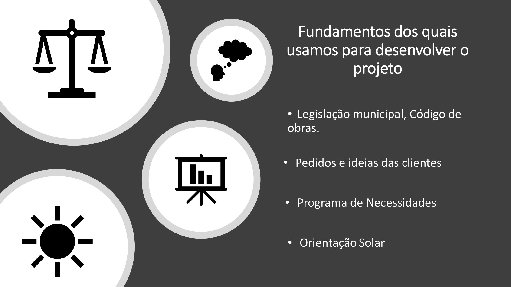

Legislação municipal e código de obras, pedidos das clientes, programa de necessidades e orientação solar. [PDF da prancha](docs/01-fundamentos.pdf)

### 2. Estudo volumétrico

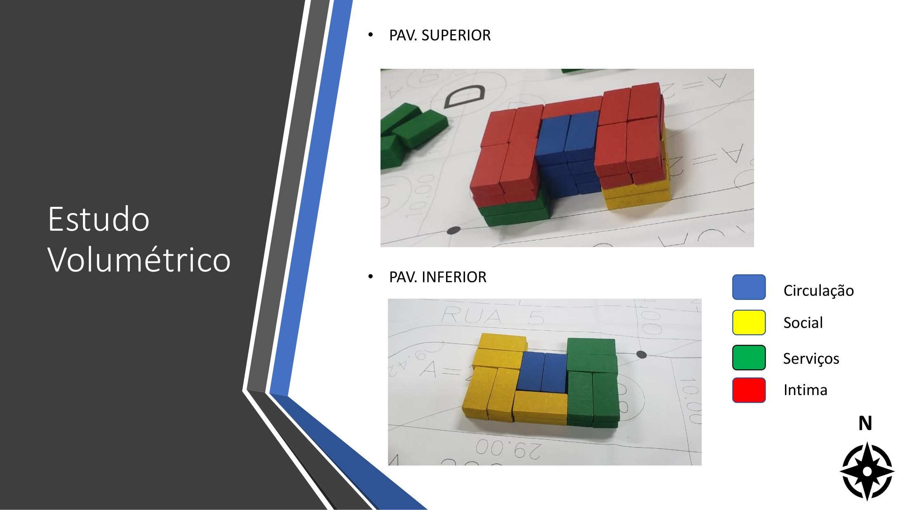

Setorização dos pavimentos superior e inferior em circulação, social, serviços e área íntima. [PDF da prancha](docs/02-estudo-volumetrico.pdf)

### 3. Fichas técnicas

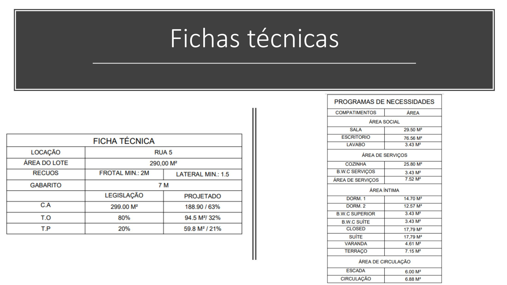

Ficha técnica do lote e programa de necessidades com as áreas previstas. [PDF da prancha](docs/03-fichas-tecnicas.pdf)

### 4. Pavimento superior (1:50)

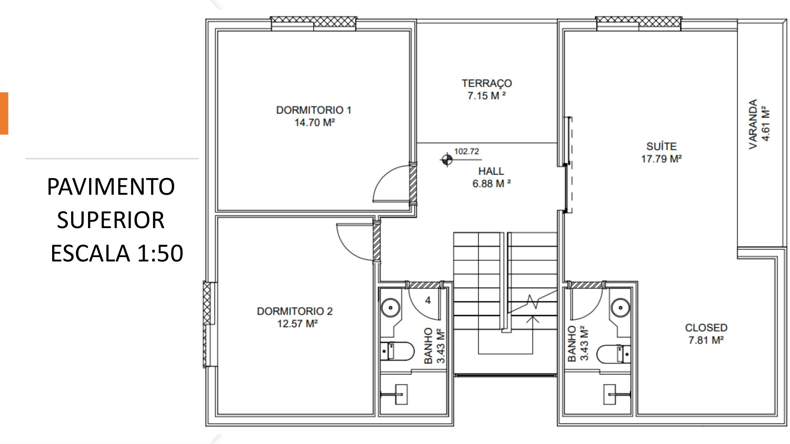

Planta humanizada do pavimento superior. [PDF da prancha](docs/04-pavimento-superior.pdf)

### 5. Pavimento inferior (1:50)

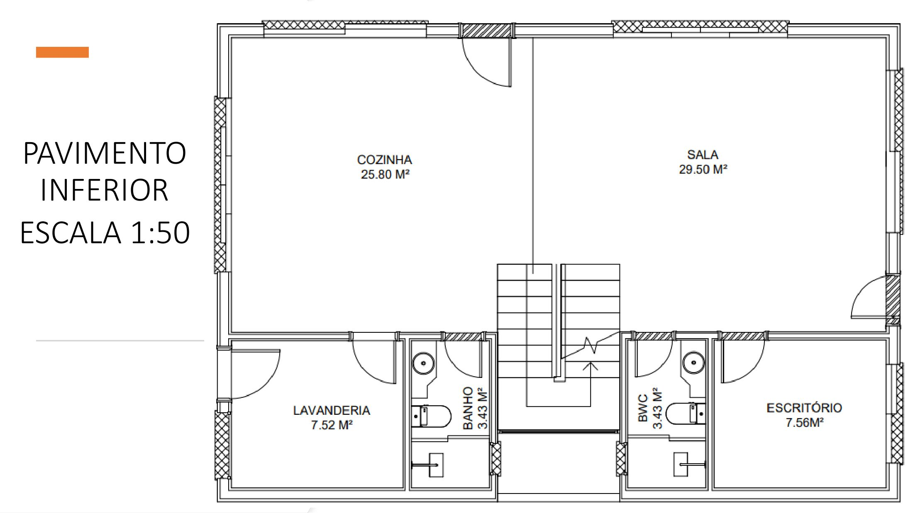

Planta humanizada do pavimento inferior. [PDF da prancha](docs/05-pavimento-inferior.pdf)

### 6. Prancha 1/5: plantas

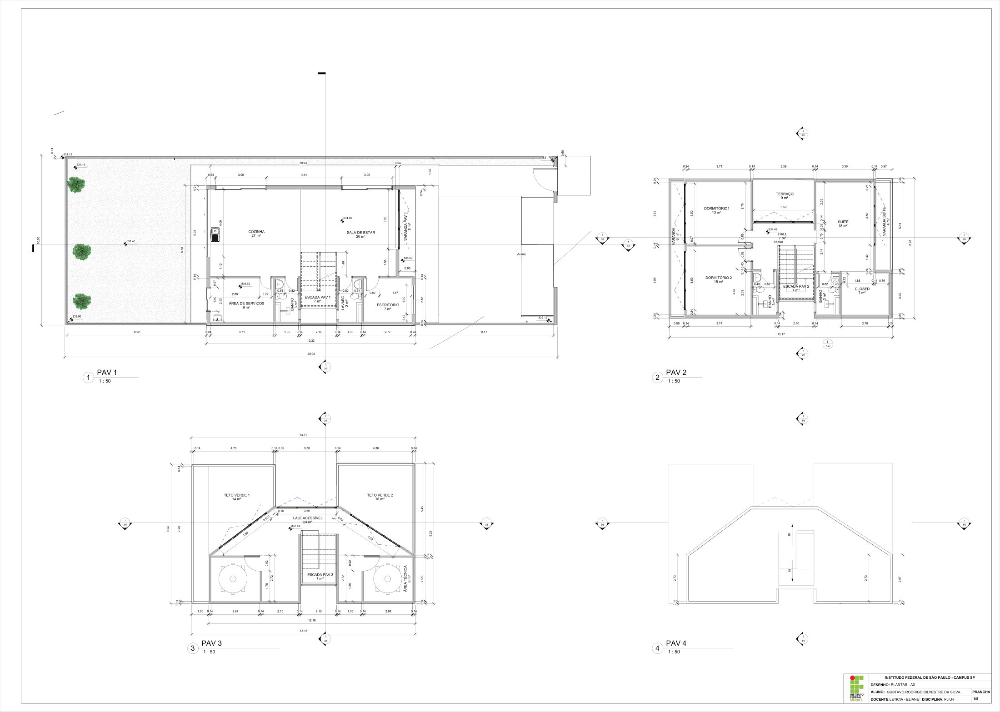

Plantas 1:50 de todos os níveis, com cotas, áreas dos ambientes e indicação de cortes. [PDF da prancha](docs/06-plantas.pdf)

### 7. Prancha 2/5: fachadas e isométrica

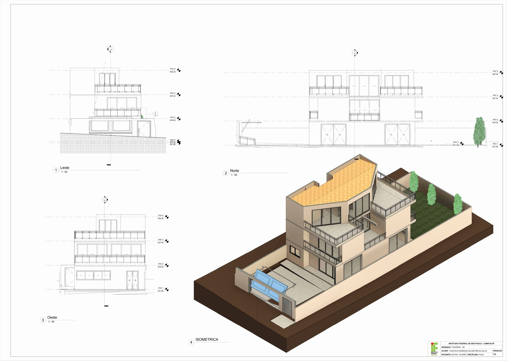

Fachadas leste, norte e oeste (1:50) e vista isométrica. [PDF da prancha](docs/07-fachadas-e-isometrica.pdf)

### 8. Prancha 3/5: cortes e detalhes

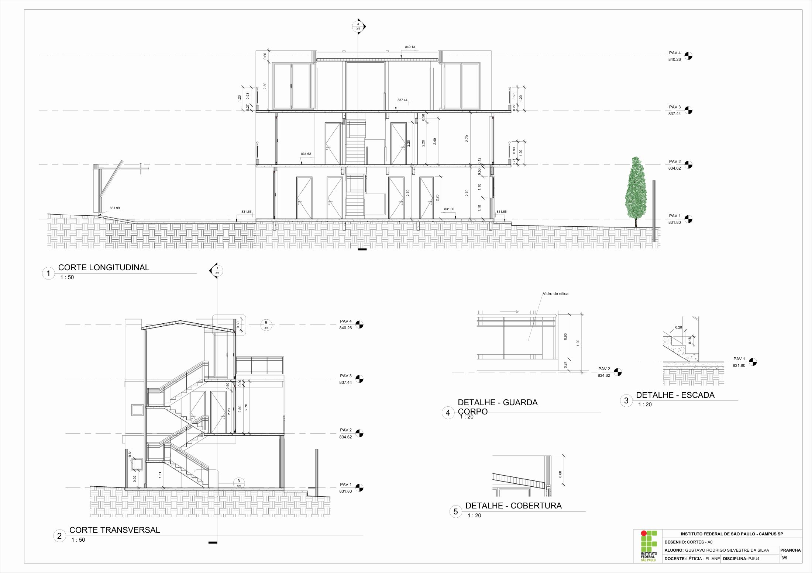

Cortes longitudinal e transversal (1:50) e detalhes da escada, do guarda-corpo e da cobertura (1:20). [PDF da prancha](docs/08-cortes-e-detalhes.pdf)

### 9. Elevações de áreas molhadas

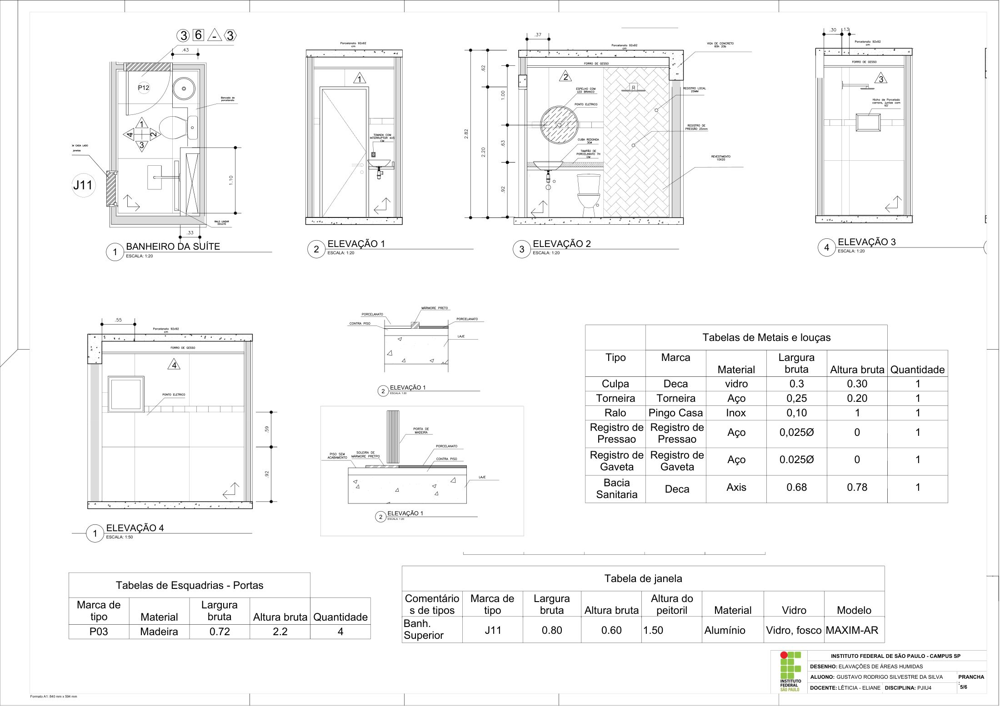

Planta e elevações do banheiro da suíte (1:20), com tabelas de esquadrias, metais e louças. [PDF da prancha](docs/09-areas-molhadas.pdf)

### 10. Implantação na quadra (1:100)

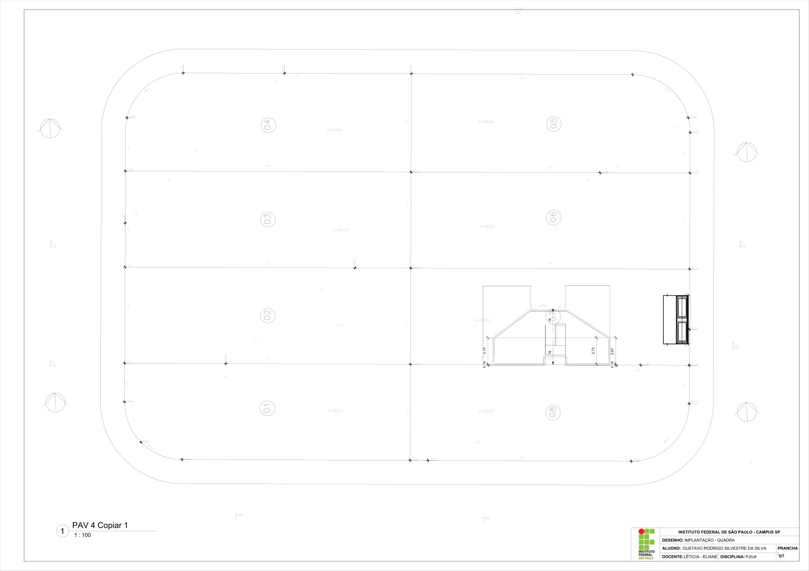

Implantação do lote na quadra, com curvas de nível e cotas. [PDF da prancha](docs/10-implantacao.pdf)

### 11. Estrutura

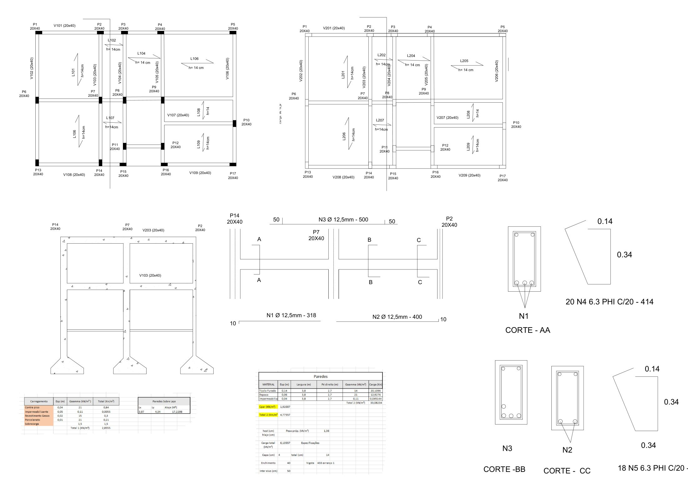

Planta de fôrmas com pilares e vigas 20×40 e lajes h = 14 cm, mais o detalhamento de armaduras das vigas (cortes AA, BB e CC). [PDF da prancha](docs/11-estrutura.pdf)

## Arquivos

| Arquivo | Descrição |
|---|---|
| [docs/residencia-unifamiliar-completo.pdf](docs/residencia-unifamiliar-completo.pdf) | Todas as 11 pranchas em um único PDF |

> A capa e a página de entrevista do documento original foram omitidas porque continham nomes e dados pessoais.
