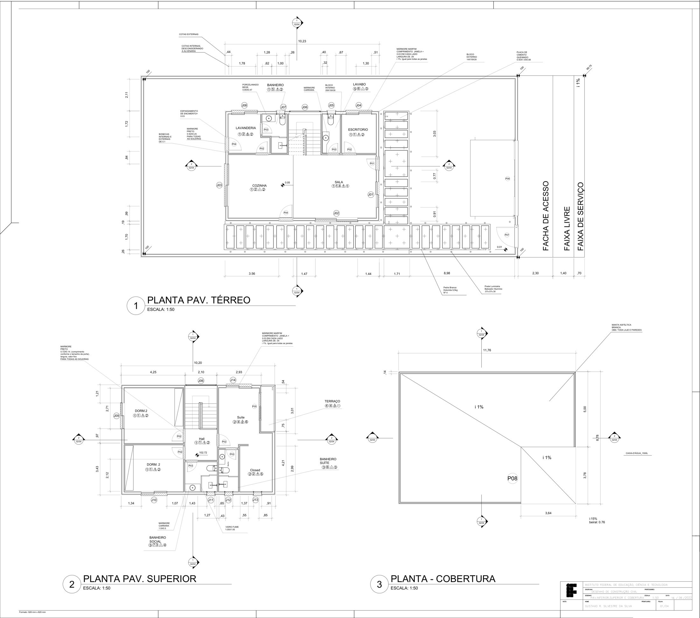
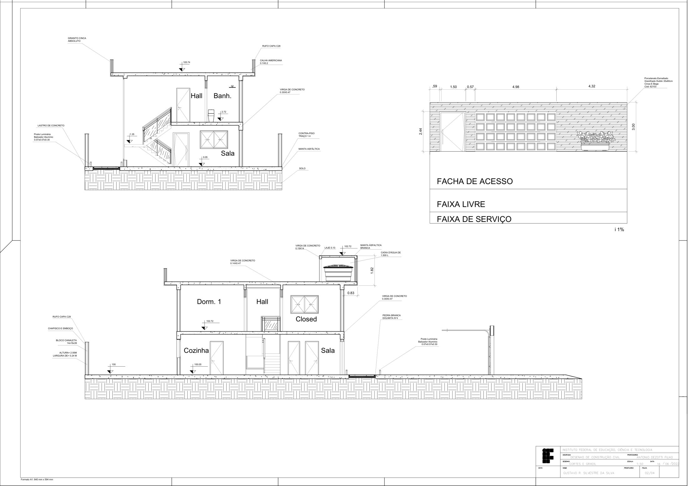
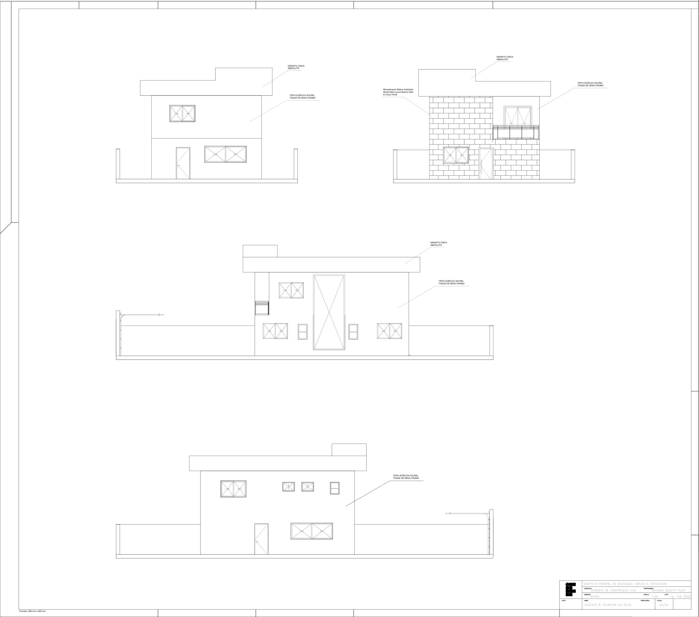
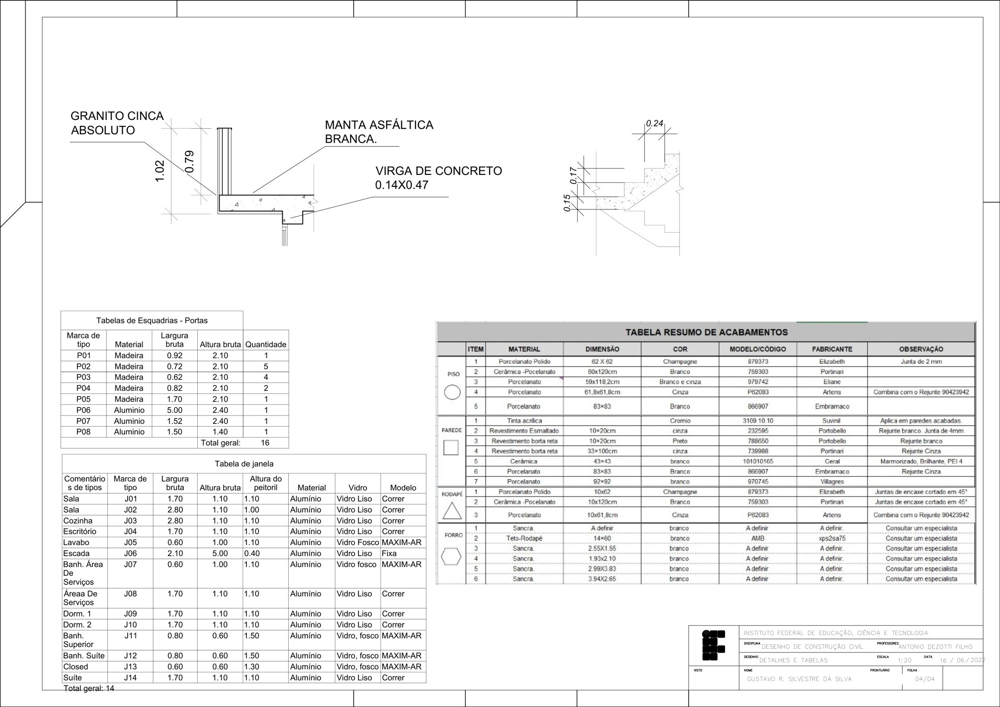

# Desenho de Construção Civil: Pranchas de uma Residência

**Disciplina:** Desenho de Construção Civil · Técnico em Edificações, IFSP – Campus São Paulo  
**Data:** junho de 2022  
**Tipo:** trabalho acadêmico individual

## Objetivo

Representar uma residência de dois pavimentos em um conjunto de 4 pranchas de desenho técnico: plantas, cortes, vistas, detalhes construtivos e especificação de materiais.

<!-- PREENCHER: software utilizado (os carimbos indicam desenho em CAD) -->

## Conteúdo das pranchas

- **Folha 01/04: plantas do pavimento inferior, superior e cobertura (1:50)**
  - revestimentos de piso e soleiras em mármore;
  - peitoris com caimento de 1%;
  - alvenaria em blocos de 14×19×39 (externa) e 9×19×39 (interna);
  - cobertura com inclinação de 15% e beiral de 0,76 m;
  - caixa d'água de 1.500 L.
- **Folha 02/04: cortes e gradil (1:50)**
  - rufo, chapisco e emboço, vergas de concreto;
  - contrapiso no traço 1:4, manta asfáltica e calha;
  - calçada com faixa de acesso, faixa livre e faixa de serviço;
  - gradil com 2,00 m de altura.
- **Folha 03/04: vistas (1:50)**
  - fachadas com a especificação dos acabamentos (granito, pintura acrílica e revestimento em relevo).
- **Folha 04/04: detalhes e tabelas (1:20)**
  - detalhes construtivos;
  - tabelas de esquadrias: 14 janelas e 16 portas.

## Pranchas

### Folha 01/04: plantas

[PDF da folha](docs/01-plantas-inferior-superior-cobertura.pdf)

### Folha 02/04: cortes e gradil

[PDF da folha](docs/02-cortes-e-gradil.pdf)

### Folha 03/04: vistas

[PDF da folha](docs/03-vistas.pdf)

### Folha 04/04: detalhes e tabelas

[PDF da folha](docs/04-detalhes-e-tabelas.pdf)

## Arquivos

| Arquivo | Descrição |
|---|---|
| [docs/desenho-construcao-civil-completo.pdf](docs/desenho-construcao-civil-completo.pdf) | As 4 folhas em um único PDF |

> O número de prontuário do aluno foi removido dos carimbos por privacidade.
