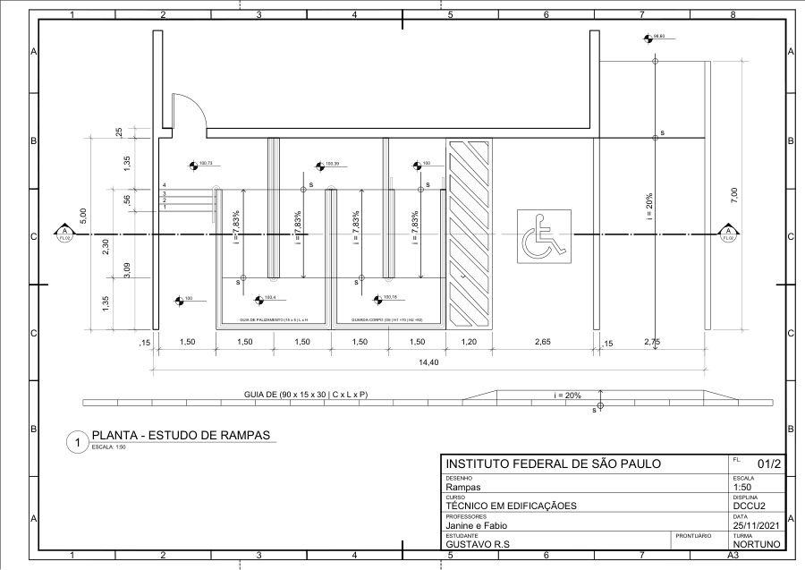

# Escada e Rampas: Desenho Técnico de Circulação Vertical

**Disciplina:** DCCU2 · Técnico em Edificações, IFSP – Campus São Paulo  
**Data:** novembro de 2021  
**Tipo:** atividades acadêmicas individuais

## Objetivo

Representar elementos de circulação vertical em desenho técnico: o corte de uma escada e o estudo de rampas com acessibilidade.

## Metodologia e resultados

- **Escada, corte AA (1:25, 10/11/2021):**
  - numeração dos degraus;
  - níveis de piso (+0,15 a +3,40);
  - cotas de piso e espelho.
- **Rampas, planta (1:50, 25/11/2021):**
  - estudo de rampas com inclinação **i = 7,83%** e rampa de veículos com **i = 20%**;
  - guia de balizamento e guarda-corpo;
  - sinalização de acessibilidade.

<!-- PREENCHER: software utilizado (provavelmente AutoCAD) -->

## Arquivos

| Arquivo | Descrição |
|---|---|
| [docs/escada-corte-AA.pdf](docs/escada-corte-AA.pdf) | Corte AA da escada |
| [docs/rampas-planta.pdf](docs/rampas-planta.pdf) | Planta do estudo de rampas |
