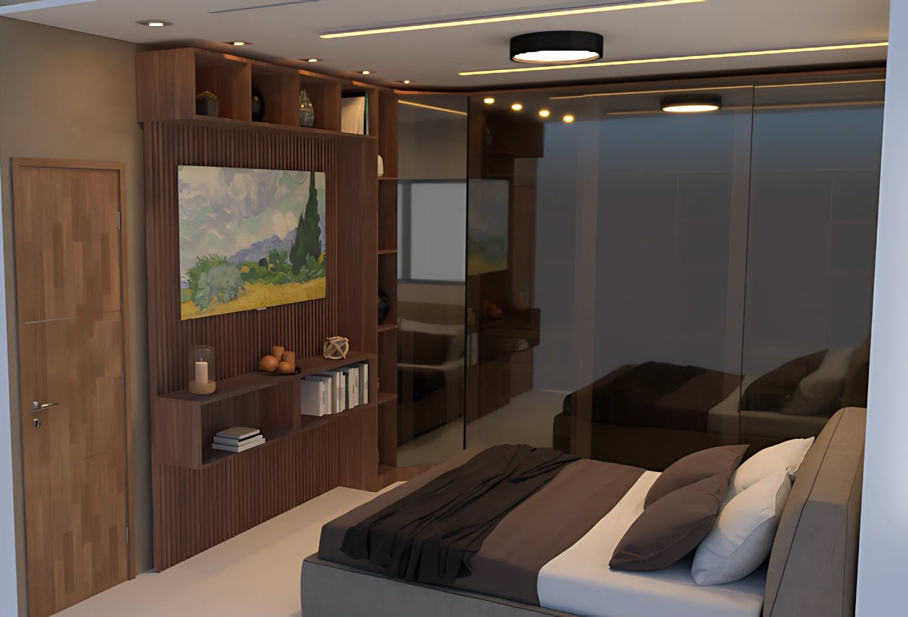
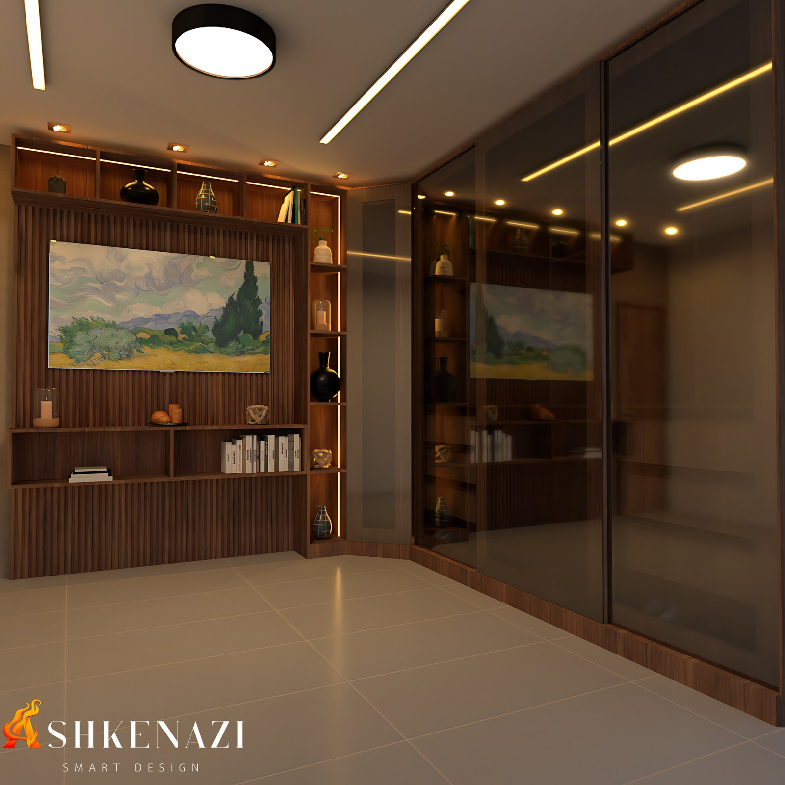
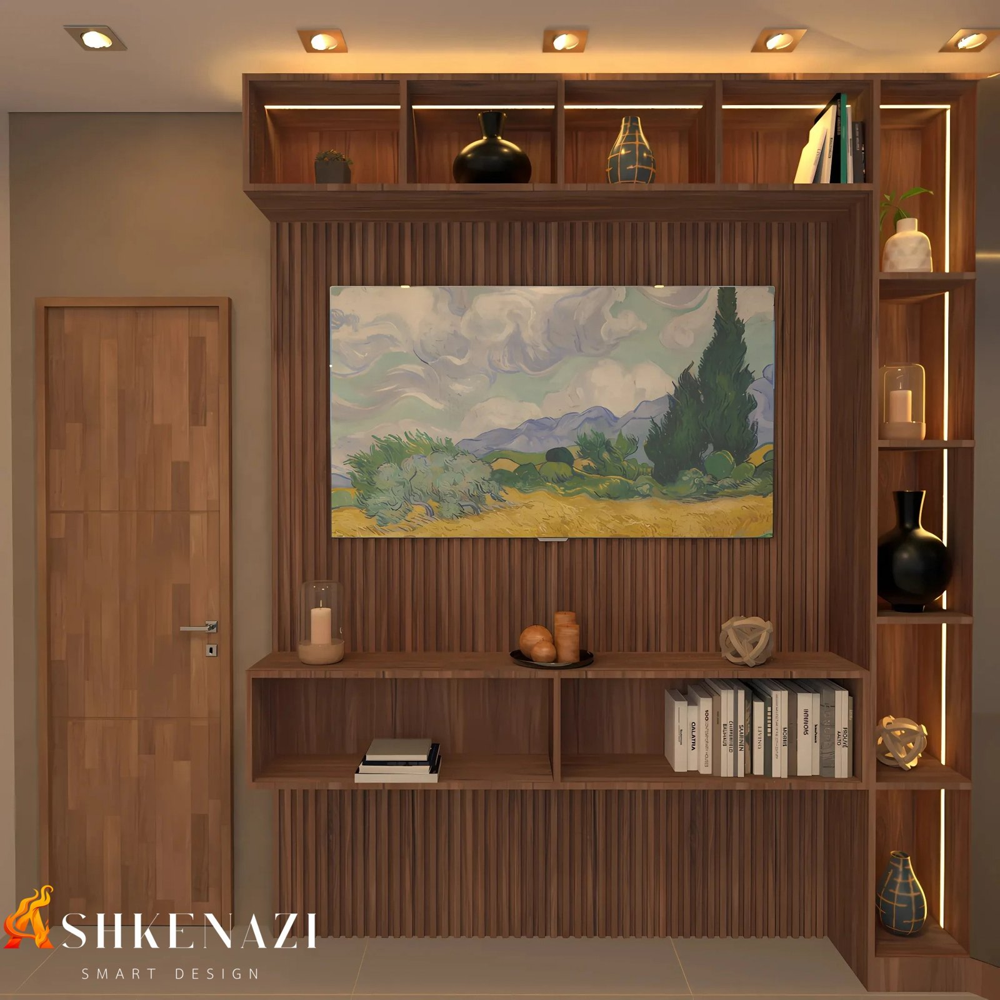

# Dormitório para Descansar: Luz, Madeira e Calma

**Conceito:** design biofílico e qualidade do sono  
**Tipo:** estudo pessoal  
**Entrega:** modelagem 3D e renders  
**Ferramentas:** SketchUp (modelagem) e V-Ray (renderização)

## A ideia

O quarto é o lugar da casa feito para desacelerar. Este estudo parte da mesma pergunta do [escritório com vista para o jardim](../escritorio-com-vista-para-jardim/), agora aplicada ao descanso: **como o ambiente pode ajudar o corpo a relaxar e a se preparar para dormir?**

A resposta combina quatro escolhas:
- **luz quente e indireta** à noite;
- **madeira** como material principal;
- uma **paisagem natural** como ponto focal;
- um ambiente **organizado**, com lugar para cada coisa.

## O que dizem os estudos

- **A luz antes de dormir importa.** Em um estudo com 116 voluntários, ficar sob a luz ambiente comum nas horas antes de deitar atrasou o início da produção de melatonina, o hormônio que sinaliza ao corpo que é noite, e encurtou sua duração em cerca de 90 minutos, em comparação com luz baixa (Gooley et al., 2011).
- **A madeira tem efeito no corpo.** Em salas em tamanho real com diferentes proporções de madeira, os voluntários tiveram variações na pressão arterial ao observar o ambiente. A sala com cerca de metade das superfícies em madeira foi a mais bem avaliada em sensação de conforto (Tsunetsugu et al., 2007).
- **Casa organizada, menos estresse.** Pessoas que descreviam a própria casa com palavras de bagunça e de "coisas por terminar" apresentaram um padrão de cortisol, o hormônio do estresse, associado a pior saúde, e mais humor deprimido ao longo do dia. Quem descrevia a casa como restauradora, com palavras de descanso e de natureza, teve o padrão oposto (Saxbe & Repetti, 2010).
- **Natureza também por materiais e imagens.** O design biofílico reúne padrões de projeto que aproximam as pessoas da natureza. Entre eles estão o uso de materiais naturais, como a madeira, e as representações da natureza, como paisagens e formas orgânicas (Browning, Ryan e Clancy, 2014).

## Como o conceito foi aplicado

- **Iluminação em camadas:**
  - luz geral no teto e spots embutidos para o dia a dia;
  - fitas de LED quentes nos nichos e no painel, que permitem deixar só uma luz baixa e indireta à noite.
- **Madeira como protagonista:**
  - painel ripado de madeira na parede de frente para a cama;
  - porta e marcenaria no mesmo tom;
  - madeira equilibrada com piso claro e paredes neutras.
- **Paisagem como ponto focal:** uma pintura de paisagem natural no centro do painel, no lugar que normalmente seria ocupado pela TV.
- **Organização:**
  - nichos e prateleiras para livros e objetos;
  - armário de piso a teto com portas de vidro fumê, que guarda tudo sem pesar visualmente.
- **Tons escuros e aconchegantes** na roupa de cama e nos acabamentos, que reforçam a sensação de recolhimento.

## Renders

| | |
|---|---|
|  |  |

## Referências

- GOOLEY, J. J. et al. Exposure to room light before bedtime suppresses melatonin onset and shortens melatonin duration in humans. **The Journal of Clinical Endocrinology & Metabolism**, v. 96, n. 3, p. E463–E472, 2011. [Artigo](https://academic.oup.com/jcem/article/96/3/E463/2833657)
- TSUNETSUGU, Y.; MIYAZAKI, Y.; SATO, H. Visual effects of interior design in actual-size living rooms on physiological responses. **Journal of Wood Science**, 2007. [Artigo](https://jwoodscience.springeropen.com/articles/10.1007/s10086-006-0812-5)
- SAXBE, D. E.; REPETTI, R. No place like home: home tours correlate with daily patterns of mood and cortisol. **Personality and Social Psychology Bulletin**, v. 36, n. 1, p. 71–81, 2010. [PubMed](https://pubmed.ncbi.nlm.nih.gov/19934011/)
- BROWNING, W. D.; RYAN, C. O.; CLANCY, J. O. **14 Patterns of Biophilic Design**. New York: Terrapin Bright Green, 2014. [Publicação](https://www.terrapinbrightgreen.com/blog/2014/09/release-of-14-patterns/)
