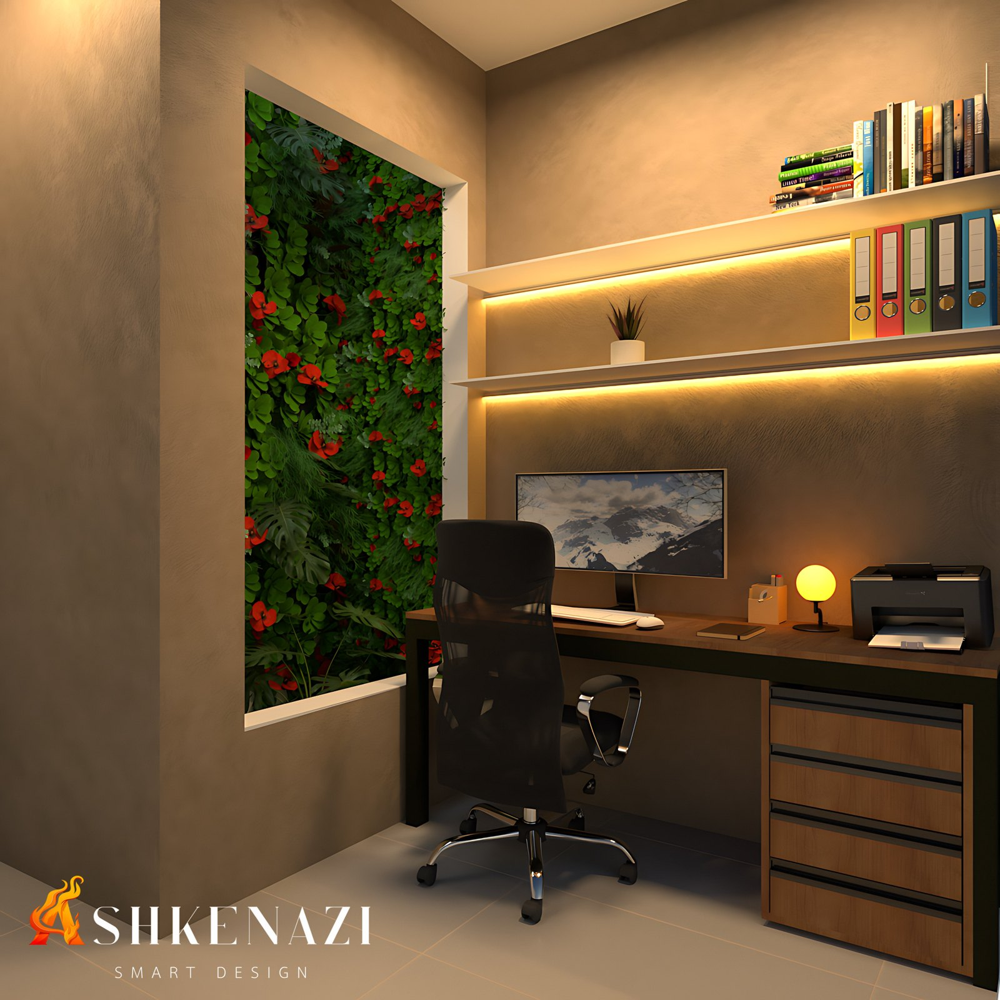
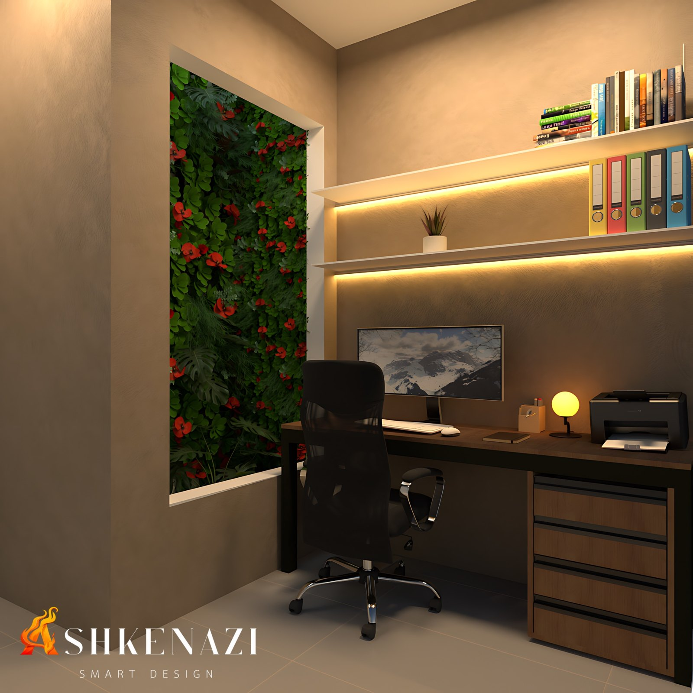
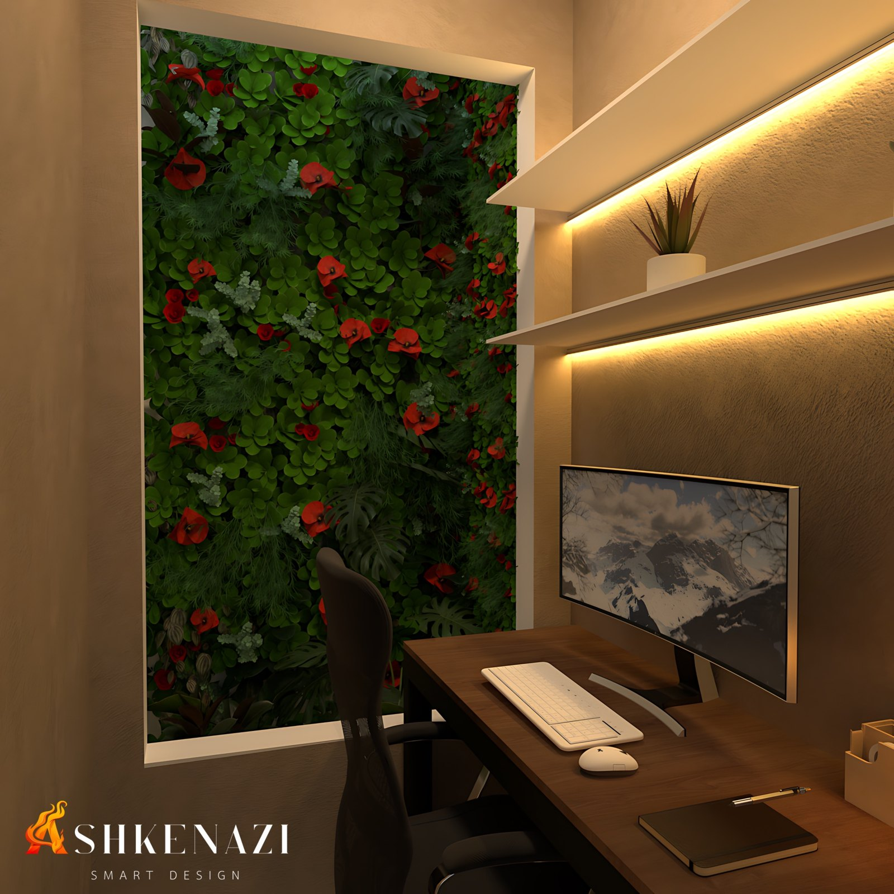
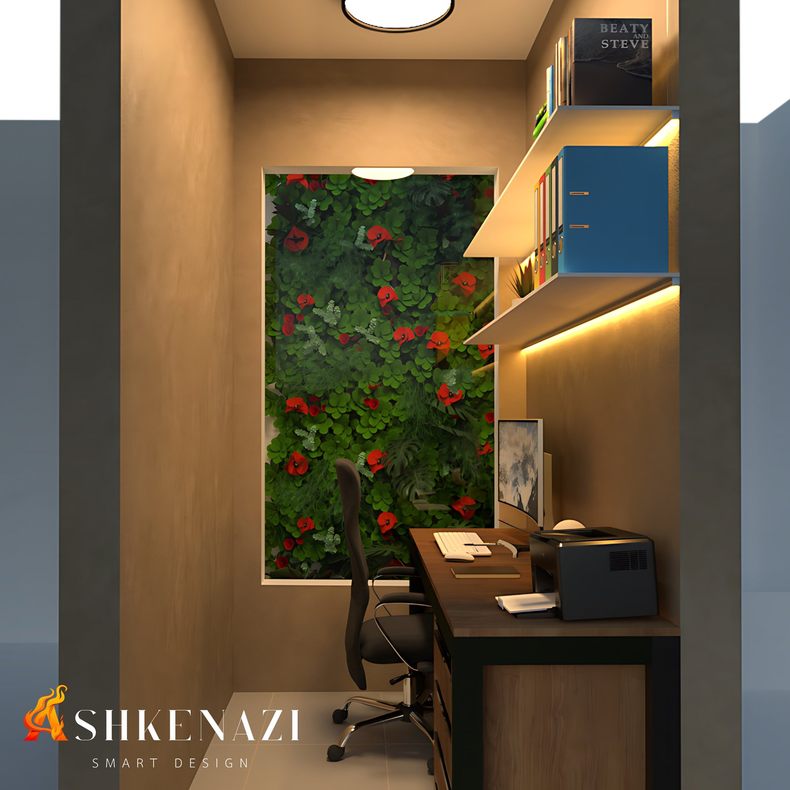

# Escritório com Vista para o Jardim: Natureza e Bem-estar no Trabalho

**Conceito:** design biofílico  
**Tipo:** estudo pessoal  
**Entrega:** modelagem 3D e renders  
**Ferramentas:** SketchUp (modelagem) e V-Ray (renderização)

## A ideia

Passamos boa parte do dia trabalhando em ambientes fechados. Este estudo parte de uma pergunta simples: **como o espaço pode ajudar quem trabalha a ficar mais calmo e concentrado?**

A resposta escolhida foi trazer a natureza para dentro do campo de visão. O escritório ganhou uma **grande abertura para um jardim**, ao lado da mesa de trabalho, para que o verde esteja sempre presente, mesmo com o olhar voltado para o computador.

Esse conceito é conhecido como **design biofílico**: aproximar as pessoas de elementos naturais, como plantas, luz e materiais orgânicos, dentro dos ambientes construídos.

## O que dizem os estudos

A relação entre natureza e bem-estar é estudada há décadas pela psicologia ambiental:

- **Recuperação mais rápida com vista para a natureza.** Em um hospital nos Estados Unidos, pacientes operados cujo quarto tinha janela para árvores ficaram menos tempo internados e precisaram de menos analgésicos fortes do que pacientes com janela para uma parede de tijolos (Ulrich, 1984).
- **A natureza descansa a atenção.** A Teoria da Restauração da Atenção propõe que ambientes naturais ajudam a recuperar a capacidade de concentração e a reduzir o cansaço mental causado por tarefas que exigem foco contínuo (Kaplan, 1995).
- **Plantas no escritório aumentam a produtividade.** Em experimentos de campo em escritórios no Reino Unido e na Holanda, colocar plantas em um ambiente antes "enxuto" aumentou a produtividade em cerca de **15%**. Os funcionários também relataram mais satisfação e concentração (Nieuwenhuis et al., 2014).
- **Bastam 40 segundos.** Estudantes que olharam por apenas 40 segundos para um telhado verde com flores tiveram melhor desempenho em um teste de atenção do que os que olharam para um telhado de concreto (Lee et al., 2015).

## Como o conceito foi aplicado

- **Jardim no campo de visão:** a abertura para o jardim ocupa praticamente toda a parede ao lado da mesa, com folhagens variadas e flores vermelhas que trazem cor e textura.
- **Luz quente e indireta:** fitas de LED sob as prateleiras e uma luminária de mesa criam uma iluminação acolhedora, sem ofuscamento na tela.
- **Materiais naturais e tons terrosos:** mesa e gaveteiro em madeira, paredes em textura de tom bege e piso claro, que reforçam a sensação de aconchego.
- **Organização:** prateleiras para livros e arquivos deixam a mesa livre, com pequenos vasos de plantas também nas prateleiras.

## Renders

| | |
|---|---|
|  |  |
|  |  |

## Referências

- ULRICH, R. S. View through a window may influence recovery from surgery. **Science**, v. 224, n. 4647, p. 420–421, 1984. [Artigo (PDF)](https://www.wrrc.arizona.edu/sites/default/files/ulrich-view%20through%20a%20window.pdf)
- KAPLAN, S. The restorative benefits of nature: toward an integrative framework. **Journal of Environmental Psychology**, v. 15, p. 169–182, 1995. [Repositório da Universidade de Michigan](https://deepblue.lib.umich.edu/handle/2027.42/150704)
- NIEUWENHUIS, M.; KNIGHT, C.; POSTMES, T.; HASLAM, S. A. The relative benefits of green versus lean office space: three field experiments. **Journal of Experimental Psychology: Applied**, 2014. [Artigo (PDF)](https://pure.rug.nl/ws/portalfiles/portal/96085206/The_Relative_Benefits_of_Green_Versus_Lean_Office_Space_Three_Field_Experiments.pdf)
- LEE, K. E.; WILLIAMS, K. J. H.; SARGENT, L. D. et al. 40-second green roof views sustain attention: the role of micro-breaks in attention restoration. **Journal of Environmental Psychology**, 2015. [Universidade de Melbourne](https://findanexpert.unimelb.edu.au/scholarlywork/977781-40-second-green-roof-views-sustain-attention--the-role-of-micro-breaks-in-attention-restoration)
