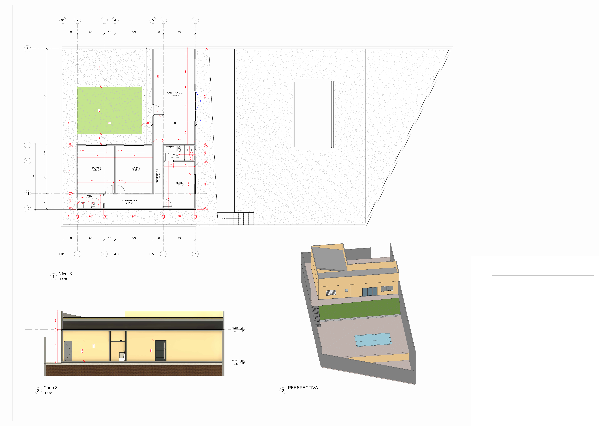

# Chácara em Igaratá/SP: Arquitetura, Estrutura e Esgoto

**Tipo:** projeto profissional para cliente particular (atuação como técnico projetista)  
**Período:** abril a julho de 2025  
**Local:** Igaratá – SP

> Por privacidade do cliente, os carimbos das pranchas foram removidos e só os desenhos foram publicados.

## Objetivo

Desenvolver o projeto de uma **residência unifamiliar térrea** em chácara, integrando três disciplinas:
- arquitetura;
- estrutura (preliminar);
- instalações de esgoto sanitário.

## Quadro de áreas

| Item | Área |
|---|---|
| Terreno | 601,01 m² |
| Construção total | 117,75 m² |
| Solo natural (permeável) | 246,43 m² (41,22%) |

**Programa:** 2 dormitórios, 1 suíte, 2 banheiros, cozinha/sala integrada (38,05 m²), corredores, área externa com piscina.

## Metodologia e conteúdo das pranchas

1. **Arquitetônico preliminar (abr/2025):** planta 1:50, corte e perspectiva 3D.
2. **Estrutural preliminar (mai/2025):** concepção do reticulado de vigas e pilares, com planta, cortes e modelo 3D.
3. **Estrutural, fundações e superestrutura:**
   - locação de **brocas Ø30** e sapatas;
   - **vigas baldrame 20×30**;
   - **pilares 15×20**;
   - **vigas 15×40**;
   - cortes com níveis.
4. **Esgoto sanitário (jul/2025):**
   - planta 1:50 e detalhes dos banheiros 1:25;
   - perspectivas isométricas;
   - tubulações de 40, 50 e 100 mm com inclinações de 1% e 2%;
   - caixas de inspeção, caixa de gordura e ventilação;
   - **tabelas automáticas de conexões e peças** (linha Tigre).

<!-- PREENCHER: software utilizado (os arquivos indicam Revit), etapa atual do projeto e se a obra foi executada -->

## Resultados

Conjunto de pranchas preliminares compatibilizadas entre arquitetura, estrutura e esgoto, com quantitativos de peças hidrossanitárias extraídos do modelo.
<!-- PREENCHER: resultados adicionais (aprovação, execução da obra etc.), se houver -->

## Arquivos

| Arquivo | Descrição |
|---|---|
| [imagens/arquitetonico-preliminar.png](imagens/arquitetonico-preliminar.png) | Planta, corte e perspectiva |
| [imagens/estrutural-preliminar-concepcao.png](imagens/estrutural-preliminar-concepcao.png) | Concepção estrutural: planta, cortes e 3D |
| [imagens/estrutural-fundacoes-vigas-pilares.png](imagens/estrutural-fundacoes-vigas-pilares.png) | Brocas, baldrames, pilares e vigas |
| [imagens/esgoto-sanitario.png](imagens/esgoto-sanitario.png) | Esgoto: planta, detalhes, isométricos e tabelas |
