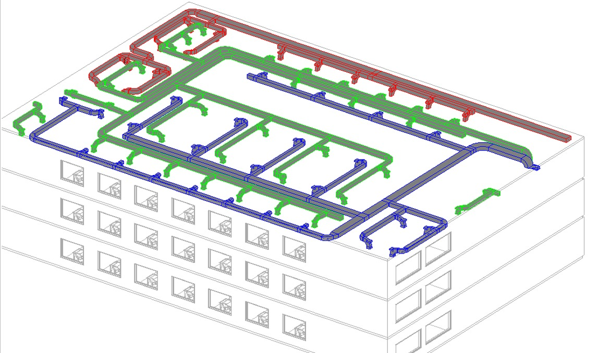
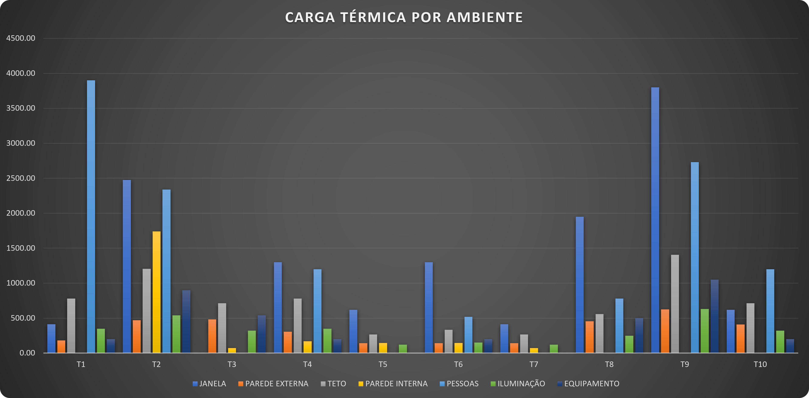
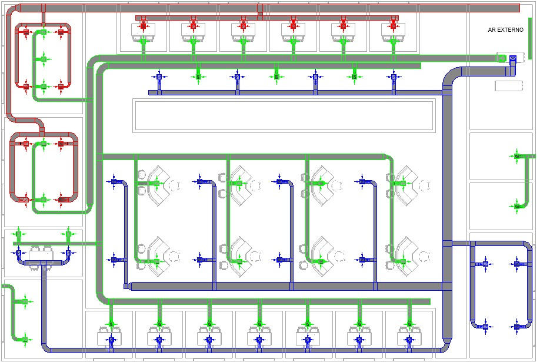

# Projeto de Climatização (HVAC): Escritório de Advocacia em Brasília/DF

**Disciplina:** PME3515 – Ar Condicionado e Ventilação · Escola Politécnica da USP
**Período:** junho de 2026
**Tipo:** trabalho acadêmico individual

## Objetivo

Dimensionar o sistema de climatização de um escritório de advocacia de três pavimentos em Brasília. O trabalho cobre:
- a carga térmica de resfriamento;
- as vazões de insuflamento por zona térmica;
- a seleção de terminais de ar, UTAs (fan-coils) e chiller;
- o diagrama unifilar do sistema AVAC.

## Caracterização do edifício

| Item | Valor |
|---|---|
| Pavimentos | 3 (idênticos) |
| Área por pavimento / total | 792 m² / 2.376 m² |
| Pé-direito | 2,70 m |
| Localização | Brasília – DF (lat. ≈ 15° S, altitude ≈ 1.172 m) |
| Fenestração | 40% da área de parede, vidro simples (2 × 4 mm) |
| Zonas térmicas | 11 (T1 a T11) |

## Metodologia

- **Normas e referências:** ABNT NBR 16401 e ASHRAE Handbook – Fundamentals.
- **Condições de projeto:**
  - Externa: TBS 31,2 °C, TBU coincidente 17,9 °C, mês de pico outubro, amplitude 11,2 °C.
  - Interna: 24 °C e 50% UR.
- **Cargas externas:** paredes, cobertura e vidros pelo método CLTD/CLF (DTCT corrigida), com variação horária por fachada entre 8h e 18h.
- **Cargas internas:** pessoas (75 W sensível + 55 W latente por pessoa), iluminação LED (10 W/m²), equipamentos (150 W por estação de trabalho) e paredes internas adjacentes a espaços não condicionados.
- **Insuflamento:** balanços de energia no ambiente e na serpentina, mais balanço de massa na caixa de mistura.
- **Terminais de ar:**
  - Rateio da vazão por zona.
  - Difusores Trox ADLQ selecionados por efeito Coanda e critério acústico NC ≤ 35.
  - Grelhas de retorno GRH com velocidade de face ≤ 2,0 m/s.
- **Dutos:** método de perda de carga constante (*equal friction*), com balanceamento por caminho.

## Resultados

| Resultado | Valor |
|---|---|
| Carga térmica global, 2º andar (pico às 18h) | **66.276 W** (59.731 W sensível + 6.545 W latente) |
| Carga térmica, térreo e 1º andar | 48.992 W |
| Ocupação / iluminação / equipamentos | 15.470 W (119 pessoas) / 7.750 W / 8.890 W |
| Capacidade das serpentinas, 2º andar | 90.207 W ≈ **25,6 TR** (2 UTAs) |
| Capacidade das serpentinas, térreo e 1º andar | 74.735 W ≈ 21,25 TR por andar |
| Chiller | Carrier AquaSmart 30EX/EV (modular, R-410A) |
| Filtragem | Dois estágios: G4 + F7 |
| Terminais | Difusores Trox ADLQ tam. 2 a 4; grelhas GRH com v_face entre 1,30 e 1,40 m/s |

**Conclusões principais:**
- A **fachada oeste é a condição crítica**: fator solar de 450 W/m² e até 1.950 W por janela. Ela exige atenção especial ao sombreamento.
- A divisão em **2 UTAs por andar** reduz a seção dos dutos (preserva o pé-direito do forro), reduz o ruído e permite zoneamento térmico independente.
- Recomenda-se prever *dampers* e caixas **VAV** para o controle.

## Arquivos

| Arquivo | Descrição |
|---|---|
| [docs/relatorio-tecnico-PME3515.pdf](docs/relatorio-tecnico-PME3515.pdf) | Relatório técnico completo (42 p.) |
| [docs/apresentacao-final-PME3515.pdf](docs/apresentacao-final-PME3515.pdf) | Apresentação final (20 slides) |
| [docs/planta-hvac-2-andar.pdf](docs/planta-hvac-2-andar.pdf) | Planta do sistema HVAC, 2º andar (1:50) |
| [docs/planta-base.pdf](docs/planta-base.pdf) | Planta base de arquitetura |
| [planilhas/calculo-termico-vidros-paredes.xlsx](planilhas/calculo-termico-vidros-paredes.xlsx) | Premissas e carga térmica de vidros e paredes internas |
| [planilhas/insuflamento-e-cargas.xlsx](planilhas/insuflamento-e-cargas.xlsx) | Cargas por zona e cálculo de insuflamento |
| [planilhas/dimensionamento-dutos.xlsx](planilhas/dimensionamento-dutos.xlsx) | Dimensionamento e balanceamento de dutos (equal friction) |
| [planilhas/memoria-calculo-vidros.pdf](planilhas/memoria-calculo-vidros.pdf) | Memória de cálculo: vidros |
| [planilhas/memoria-calculo-paredes-internas.pdf](planilhas/memoria-calculo-paredes-internas.pdf) | Memória de cálculo: paredes internas |
| [imagens/](imagens/) | Gráficos de carga por fachada, cobertura e ambiente; diagrama; modelo 3D |
| [videos/](videos/) | Três percursos virtuais do modelo 3D (Revit) |

**Ferramentas:** Revit (modelagem MEP), Excel (memórias de cálculo).
