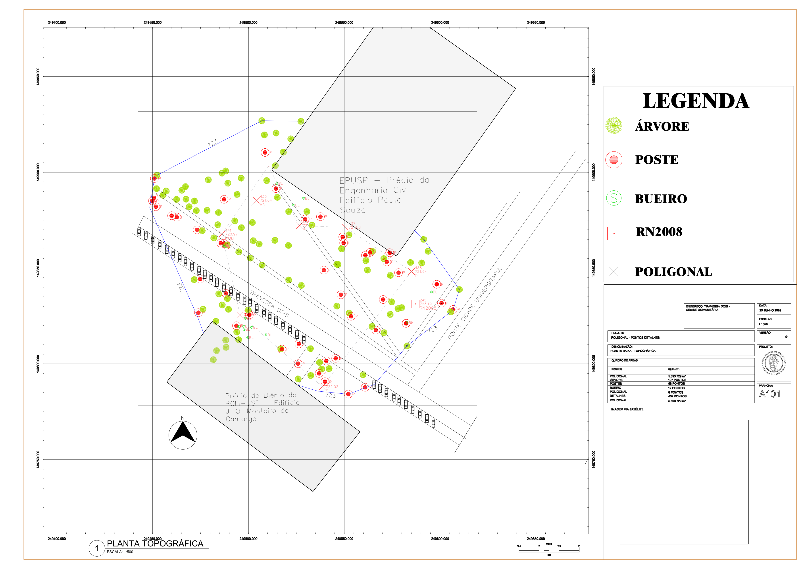

# Levantamento Topográfico: Cidade Universitária (USP)

**Disciplina:** Geomática · Escola Politécnica da USP <!-- PREENCHER: código da disciplina -->
**Data:** 25 de junho de 2024
**Tipo:** trabalho em grupo (7 integrantes)
<!-- PREENCHER: sua contribuição no grupo (campo, cálculo da poligonal, desenho etc.) -->

## Objetivo

Fazer o levantamento planialtimétrico de uma área na Cidade Universitária, entre o Prédio da Engenharia Civil (Edifício Paula Souza) e o Prédio do Biênio (Edifício J. D. Monteiro de Camargo), na Travessa Dois, e elaborar a planta topográfica.

## Metodologia

- Implantação e medição de uma **poligonal** com 8 vértices, referenciada à **RN2008**.
- Levantamento por irradiação dos **pontos de detalhe**, com codificação por tipo de elemento (árvore, poste, bueiro etc.).
- Processamento das coordenadas (E, N, cota) e elaboração da planta em CAD.

## Resultados

| Elemento | Quantidade |
|---|---|
| Área da poligonal | 5.693,729 m² |
| Pontos de detalhe | 432 |
| Árvores | 107 |
| Postes | 58 |
| Bueiros | 17 |
| Vértices da poligonal | 8 |

A planta topográfica foi entregue com legenda e malha de coordenadas.

## Arquivos

| Arquivo | Descrição |
|---|---|
| [imagens/planta-topografica.png](imagens/planta-topografica.png) | Planta topográfica (1:500) |
| [dados/pontos-levantados.txt](dados/pontos-levantados.txt) | Pontos levantados (id, E, N, cota, código) |
| [dados/pontos-levantados.xlsx](dados/pontos-levantados.xlsx) | Mesmos pontos em planilha |

> Os nomes e números USP dos colegas foram removidos do carimbo por privacidade.
